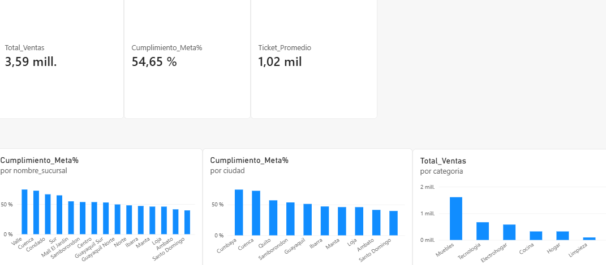

# Análisis de Cumplimiento de Metas de Ventas — Servicat

Proyecto de portafolio en ciencia de datos: análisis de cumplimiento de metas de ventas mensuales por sucursal, usando SQL, Python y Power BI.

## 📋 Fuente de los datos

Este proyecto utiliza un dataset de práctica ("Servicat Retail"), diseñado para pruebas técnicas y aprendizaje de análisis de datos. Los nombres de clientes, sucursales y transacciones son ficticios y no corresponden a ninguna empresa o persona real.

## 🧩 Problema

Servicat es una cadena retail con 15 sucursales distribuidas en 8 ciudades de Ecuador. La empresa define metas de ventas mensuales por sucursal, pero no contaba con un análisis que mostrara qué sucursales cumplían esas metas, en qué meses, ni qué factores (ciudad, categoría de producto) explicaban las diferencias de desempeño entre ellas.

## 🎯 Objetivo

Identificar el cumplimiento de metas de ventas por sucursal durante 2024, y detectar patrones de desempeño según ciudad y categoría de producto.

## 📏 Alcance

**Incluye:**
## 💼 Alcance de negocio

Este proyecto entrega un análisis diagnóstico (no solo descriptivo) del desempeño comercial: no se limita a reportar cifras de venta, sino que segmenta el KPI (indicador clave de desempeño) de cumplimiento de metas por tres dimensiones (sucursal, ciudad, categoría de producto) para aislar dónde se concentra la brecha de desempeño. Esto habilita a la gerencia comercial a asignar recursos de forma dirigida en lugar de uniforme y establece la línea base de monitoreo necesaria antes de escalar hacia modelos predictivos de forecasting de ventas.

**No incluye:**
- Predicción de ventas futuras (machine learning).
- Automatización o integración en la nube.
- Períodos anteriores a 2024 (no hay datos disponibles).

## 🛠️ Herramientas y proceso

- **Carga y limpieza de datos** — Python (pandas) en Google Colab: verificación de nulos, duplicados y tipos de dato; no fue necesario corregir inconsistencias.
- **Transformación** — Python (pandas): extracción de año/mes de fechas; cálculo del valor de cada venta.
- **Análisis exploratorio** — SQL y Python: agrupación de ventas por sucursal/mes, cruce con metas, cálculo de % de cumplimiento.
- **Visualización** — Power BI (DAX): modelo de datos relacional y dashboard interactivo.

## 📊 Conclusiones:

- El **90%** de los casos sucursal-mes analizados no alcanzó su meta de ventas en 2024, con un cumplimiento promedio de solo **55%**.
- Existe una brecha de más de **35 puntos porcentuales** entre la ciudad con mejor desempeño (Cuenca/Cumbayá, ~81%) y las de peor desempeño (Santo Domingo/Ambato, ~45%).
- La categoría con más transacciones (**Cocina**) no es la que más ingresos genera: **Muebles** lidera en ingresos totales gracias a un ticket promedio significativamente más alto ($3,005 vs. $552).
- Este análisis le da a la gerencia comercial una base concreta para decidir dónde reforzar esfuerzos (por sucursal y ciudad) y qué categorías de producto priorizar, antes de invertir en modelos predictivos más complejos.

## 📈 Dashboard

## 📁 Contenido del repositorio

- `base_datos_servicat_pbi.xlsx` — dataset original.
- `Servicat1.ipynb` — notebook de Python con el proceso completo (limpieza, transformación y análisis).
- `Analisis_Cumplimiento_Metas_Servicat.pbix` — archivo de Power BI con el modelo de datos y el dashboard.
- `dashboard_servicat.png` — captura del dashboard final.

